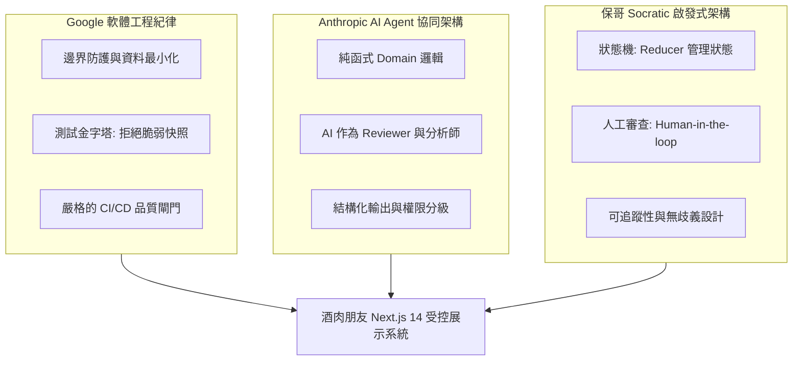

# 酒肉朋友 AI 架構診斷與工程實踐報告
> **整合三份權威框架**：Google 軟體工程紀律與邊界控制 × Anthropic 受控 AI Agent 架構 × 保哥 Socratic 狀態機與可審查性思維

---

## 專案核心定位：受控展示型 AI 專案（Controlled Demo）

「酒肉朋友」定位為**美食、肉品細切與經典調酒搭餐之互動展示 Demo**，而非可接受真實訂單、付款、配送或蒐集真實年齡資料的商業交易服務。
本專案採用**「前端互動層 ＋ 受控資料層 ＋ 核心領域邏輯層 ＋ 自動化品質閘門」**的解耦架構，落實負責任的 AI 開發與工程紀律。

---

## 一、三大權威顧問框架診斷精要



### 1. Google 軟體工程紀律（Engineering Discipline & Risk Boundaries）
- **拒絕假想合規**：Demo 不得模擬「已完成法定年齡驗證」的假象，明確標註 Demo 邊界與 18+ 警語，不保存任何真實出生日期或身分資訊。
- **測試金字塔實踐**：不以單一覆蓋率數字為目標，著重於推薦演算法邊界案例（單元測試）與關鍵使用者路徑（E2E 測試），避免脆弱的快照測試。
- **自動化防線**：在 PR 階段透過 CI 閘門（Typecheck + Lint + Unit Tests + Build）阻擋回歸缺陷。

### 2. Anthropic AI 協同架構（Controlled AI & Adapter Architecture）
- **核心領域邏輯解耦**：將推薦規則與配對矩陣抽離為純函式（Pure Functions），不依賴 React 元件或外部 API，使規則可獨立測試、可置換為 AI Adapter。
- **AI 導師權限分級**：AI 扮演架構分析、測試生成與 PR 審查輔助角色（L0-L2），禁止 AI 自動合併代碼或修改正式設定（L5-L6 嚴格禁止）。
- **結構化工件產出**：所有 AI 輸出需具備嚴重度、影響範圍、測試建議與是否需人工核准標記。

### 3. 保哥 Socratic 啟發式架構（State Machine & Human Review）
- **有限狀態機（FSM）**：以 `useReducer` 集中管理多步驟 Wizard 狀態，確保狀態流轉明確，杜絕幽靈點擊與非法跳轉。
- **以人為核心的審查（Human-in-the-loop）**：AI Code Review 是第二雙眼睛，而非唯一批准者；所有高風險與法規文案變更皆須人工核准。

---

## 二、目標分層系統架構

```
使用者瀏覽器 (Browser / RWD)
      │
      ▼
Next.js 14 App Router (Presentation Layer)
      │
      ├── 1. Wizard 互動呈現層 (Presentation)
      │      ├── 步驟與進度元件 (Step / Progress)
      │      ├── 推薦結果卡片 (Result Cards)
      │      └── 法律與邊界免責 (DemoDisclaimer / 18+ Notice)
      │
      ├── 2. 客戶端狀態機層 (State Machine)
      │      ├── wizardReducer.js (Action Dispatcher)
      │      ├── 多語系同步管理 (i18n: zh-TW / en / ja)
      │      └── 防禦性邊界驗證
      │
      ├── 3. 純領域業務層 (Pure Domain Logic)
      │      ├── calculateRecommendation.js (肉品推薦純函式)
      │      ├── 風味協同配對矩陣 (Meat × Cocktail Synergy)
      │      └── 100% 無副作用單元測試 (Vitest)
      │
      ├── 4. 受控資料存取層 (Data Access & Mock Adapters)
      │      ├── beefData / porkData / fishData (標記 isDemo: true)
      │      ├── cocktailData (10 款調酒規格與配對)
      │      └── 抽象 Adapter 介面 (隨時可替換為 AI API)
      │
      └── 5. 品質保證與治理層 (Quality & Governance)
             ├── TypeScript / ESLint
             ├── Vitest (20+ 邊界單元測試)
             ├── Playwright (E2E Happy Path & 安全斷言)
             └── GitHub Actions CI 阻擋閘門
```

---

## 三、12 項顧問架構診斷清單與落地對照

| 編號 | 診斷面向 | 顧問指引要求 | 專案落地成果 |
| :--- | :--- | :--- | :--- |
| **01** | **專案定位與邊界** | 嚴格定位為 Demo，禁止真實購買、付款與個資保存 | 全站配置 `DemoDisclaimer`，資料均標記 `isDemo: true, isPurchasable: false` |
| **02** | **系統分層架構** | UI、狀態、Domain、資料存取四層分離 | 建立 `src/domain/` 專屬目錄，邏輯與 React 完全解耦 |
| **03** | **Wizard 狀態管理** | 避免 useState 散落，改用狀態機管理 | 實作 `wizardReducer.js`，支援重設、跳轉與動作防護 |
| **04** | **推薦規則純函式** | 規則抽成無副作用純函式，支援跨端復用 | 實作 `calculateRecommendation.js`，具備極端值回退防護 |
| **05** | **調酒搭餐科學矩陣** | 依酸度、酒體、草本香氣建立科學配對 | 建立 10 款調酒資料庫與風味協同（Flavor Synergy）演算法 |
| **06** | **測試金字塔構建** | 核心規則單元測試 + 關鍵流程 E2E | 20+ Vitest 單元測試全部通過，配置 Playwright E2E |
| **07** | **AI 導師權限防護** | AI 輔助審查，不直接授權自動合併或部署 | 規範 AI 工具權限等級 L0-L6，建立 PR Template 檢核清單 |
| **08** | **CI/CD 自動化閘門** | PR 必須通過 Typecheck、Lint、Test、Build | 建立 `.github/workflows/quality-gate.yml` 自動攔截 |
| **09** | **多語系與可及性** | 支援多國語系即時同步，文字無擠壓 | 支援繁中、英文、日文三語即時切換，響應式 RWD 導航 |
| **10** | **資料治理與安全** | 排除敏感 .env，最小化資料傳輸 | 建立 `.env.example`，無任何私鑰或個資提交於前端 |
| **11** | **防禦性程式設計** | 處理空陣列、無效 ID、網路異常等極端情境 | 所有函式均具備預設參數與防禦性 fallback |
| **12** | **可觀測性與演進** | 保留未來正式化之擴充接點（API Adapter） | 模組化介面，未來可無痛切換為後端 Microservices 或 LLM |
| **13** | **AI 設計合約規格** | 建立統一 DESIGN.md，防範 AI 產生通用樣式與視覺跳 Tone | 建立根目錄 `DESIGN.md`，定義 Design Tokens、元件規範與 Anti-patterns |

---

## 四、AI 工具權限分級矩陣（Security & Governance）

| 等級 | 權限名稱 | AI 允許行為 | 專案規範與防護 |
| :---: | :--- | :--- | :---: |
| **L0** | **唯讀分析** | 讀取專案代碼、分析架構、解釋依賴關係 | ✅ 允許（由開發者發起） |
| **L1** | **工件生成** | 生成測試案例草稿、文檔草稿、PR 審查意見 | ✅ 允許（結構化輸出） |
| **L2** | **分支協同** | 於開發分支建立變更或輔助開啟 PR | ✅ 允許（需人工確認） |
| **L3** | **本機驗證** | 執行 `npm test`、`npm run lint`、`npm run build` | ✅ 允許（驗證變更） |
| **L4** | **代碼修改** | 修改應用程式原始碼 | ⚠️ **需 Human-in-the-loop 確認** |
| **L5** | **合併與發布** | 自動合併 PR 至 main、直接觸發正式環境部署 | ❌ **嚴格禁止** |
| **L6** | **機密存取** | 讀取金鑰、存取生產資料庫、操作付款模組 | ❌ **嚴格禁止** |

---

## 五、結論與持續演進藍圖

本專案已成功建立高可靠、可測試、可審查的工程基線。透過「受控展示邊界」與「解耦領域層」，在保證合規與安全的前提下，為未來的 AI 推薦升級與多端拓展奠定了最扎實的架構基石。
